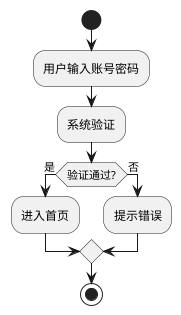
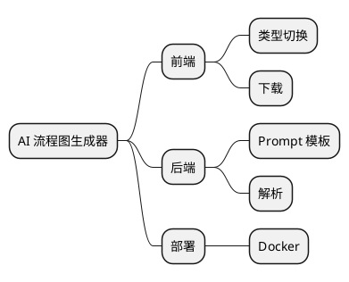
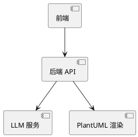

# FlowAI - AI 图表生成器

> 用自然语言描述业务或想法，AI 在 **Excalidraw 双通道白板** 上生成并持续编辑 **流程图 / 思维导图 / 架构图**。

> ⚠️ **Status（2026-09-14）**：本文档描述的是**目标架构**。早期链路（`POST /api/generate` → SVG/PlantUML、`POST /api/download`、`static/` 旧 UI）已于 M1 前置清算中**全部删除**，后端 API 现存仅 `GET /api/health`；目标链路（`POST /api/chat` + agent/tools/session/IR）自 M1 起重建。工程底座（M0）已闭合，进度与约束见 `workbuddyFlow/`。

## ✨ 特性（目标）

- 🤖 **聊天驱动出图**：用自然语言对话逐步生成、修改图表，而非一次性文本转图
- 🎨 **Excalidraw 双通道白板**：手绘画布 + AI 聊天命令改同一份图；人类拖拽与 AI 编辑互不覆盖
- 🧠 **后端持有图状态（IR）**：图的语义与坐标唯一真相源在后端 session（Redis 优先），前端只持渲染镜像
- 🔁 **增量 / 全量双协议**：对话里的小改返回增量 `ops`，"换一个复杂的"返回全量 `spec`
- 📖 **API 文档**：集成 springdoc-openapi，启动即获交互式 Swagger 文档
- 🐳 **容器化部署**：多阶段 Dockerfile + docker-compose
- ✅ **测试覆盖**：36 个 JUnit 5 单元测试（解析 / 校验 / 模板 / 响应契约）

## 技术栈

| 层 | 技术 |
|----|------|
| 后端 | Spring Boot 3.2 + Java 17 |
| AI | LLM（OpenAI 兼容协议，默认 Moonshot/Kimi `kimi-k2.7-code-highspeed`） |
| 图状态 | IR（语义 + 坐标），后端 session 持有（Redis 优先，内存降级） |
| 画布 | `@excalidraw/excalidraw` 双通道白板（React 18 + Vite + TS + Zustand 外壳） |
| 文档 | springdoc-openapi（Swagger UI） |
| 部署 | Docker / docker-compose |

## 架构（目标）

```
用户聊天消息 {message, ctx}
   ↓  POST /api/chat（SSE 流式）
controller  ── 参数校验
   ↓
agent       ── 从 session 取当前 model（IR）；组装 prompt + 模型 + 意图
   ↓          LLM 推理（复杂任务走 ReAct + Diagram Tools 自研 MCP 改后端 model）
graph       ── 校验（field/reason/hint），不通过带 issues 再调（≤3 轮）
   ↓          落库 session
前端        ── 收到 ops（增量）/ spec（全量）→ apply 到本地镜像 → layout → convert → 重绘
人类拖拽    ── onChange → PATCH /api/model/positions 坐标回写后端（与 AI 改图汇到同一份 model）
```

`LlmProvider` 是统一接口，`OpenAiCompatibleProvider` 是其实现（带 usage 日志）。
后续可在此基础上叠加：固定规则路由、限流、Token 预算、Fallback、重试、成本审计（装饰器模式）。
agent / tools / session / rag / infra 等包按 `docs/架构规划-v2.md` 生长。

## 项目结构（目标）

```
src/main/java/io/github/nihaoljx/flowchart/
├── controller/    REST + SSE 接口层（/api/chat 等，只做参数校验与编排）
├── service/       生成编排：Prompt 组装 → LLM 调用 → 解析 → 校验 → 修正循环
├── llm/           LLM 接入层：Provider 抽象、Gateway 网关、路由降级
├── graph/         图模型与校验：GraphJson、GraphValidator、布局（后端不出图，渲染与坐标由前端兜底）
├── rag/           检索增强（阶段 2 建）
├── tools/         工具注册与执行（阶段 3 建）
├── agent/         Agent 规划与执行：真 ReAct 循环（阶段 4 建）
├── session/       会话与记忆：Store 抽象 + Redis 实现 + 内存降级（阶段 5 建）
└── infra/         可观测：调用链 Trace、指标、审计日志（阶段 7 建）
frontend/                       # 阶段 0 v2-6 已建：React 18 + Vite + TS（Excalidraw 双通道待阶段 6 接入）
```

> 注：`DiagramController` 已清算为只剩 `GET /api/health`——早期 `/api/generate`（SVG/PlantUML）链路连同 `DiagramService`、`plantuml` 依赖、`static/` 旧 UI 于 2026-09-14 一并删除；目标 `/api/chat` 由阶段 1（v2-8 起）补入。早期结构见 git tag `archive/v0.3-full-tasks`。

## 快速开始

### 1. 配置 API Key（用环境变量，不要写进代码）

```powershell
setx LLM_API_KEY sk-你的真实key
echo $env:LLM_API_KEY
```

> ⚠️ 切勿把真实 Key 硬编码进 `application.yml`，也不要提交 `.env` 文件（已在 `.gitignore` 忽略）。

### 2. 启动

**方式 A（开发）**：IDEA 直接运行 `FlowchartApplication`。

**方式 B（命令行）**：

```cmd
mvn package -DskipTests
java -jar target/flowchart-0.0.1-SNAPSHOT.jar
```

### 3. 打开

后端目前只提供健康检查，无前端页面（早期静态页已删除）。用 Swagger UI 调试接口：

**http://localhost:8080/swagger-ui.html**

> 目标 Excalidraw 双通道白板在 `frontend/`（脚手架已就绪，待阶段 6 接入）。

## API 接口

启动后访问 **http://localhost:8080/swagger-ui.html** 查看交互式文档并可在线调试。

| 方法 | 路径 | 说明 |
|------|------|------|
| GET  | `/api/health` | 健康检查（容器探活）— **当前唯一已实现的端点** |
| POST | `/api/chat` | **（目标）** 聊天改图：SSE 流式返回思考 / 工具 / 校验事件 + 最终 ops/spec — 阶段 1（v2-11）补入 |

> 早期端点 `POST /api/generate`（文字 → SVG + PlantUML）与 `POST /api/download` 已于 2026-09-14 清算删除，
> 且不会恢复：目标架构下后端不渲染图片（见 `workbuddyFlow/docs/architecture.md` ADR-4）。

**`/api/chat` 请求体（目标）**：

```json
{
  "message": "加一个审核节点，连到支付之后",
  "ctx": { "sessionId": "xxx" }
}
```

**响应**：SSE 事件流，末段携带 `ops`（增量）或 `spec`（全量 IR，无坐标），前端据此重绘。

## 图表示例

（以下 PlantUML 代码块是**早期链路的历史示例**，用来说明当时的能力；后端已不再渲染 PlantUML/SVG。
目标阶段改为在 Excalidraw 白板上交互生成。）

### 流程图（flowchart）

输入：`用户输入账号密码→系统验证→进入首页`



### 思维导图（mindmap）

输入：`AI 流程图生成器的核心模块`



### 架构图（architecture）

输入：`前端调用后端，后端调 LLM 和 PlantUML`



## Docker 部署

适用于「部署到服务器 / 云」场景，本机开发不需要 Docker。

```cmd
docker compose up --build -d
docker compose logs -f
docker compose down
```

API Key 通过环境变量传入（docker-compose 已配置读取宿主机 `LLM_API_KEY`）。
如需本地 `.env`，在项目根目录创建并写入 `LLM_API_KEY=sk-xxx`（已被 `.gitignore` 忽略）。

## 测试

```cmd
mvn test
```

当前 36 个 JUnit 5 单元测试，均为纯逻辑测试，不依赖 Spring 容器与网络：

| 测试类 | 数量 | 覆盖 |
|---|---|---|
| `ParserServiceTest` | 12 | JSON → 对象解析与业务校验（start/end 唯一、decision 两条出边、边引用存在） |
| `OpenAiCompatibleProviderTest` | 10 | LLM HTTP 调用：请求拼装、OpenAI 兼容响应解析、401 / 缺字段 / 非法 JSON |
| `PromptServiceTest` | 5 | 模板加载与占位符替换 |
| `ModelContractTest` | 6 | `Result` 响应外壳、`MindmapData` 递归兜底 |
| `DiagramControllerTest` | 3 | `/api/health` 契约 + 旧端点下线防回归 |

提交前建议跑完整门禁（与 CI 同一套三步）：`workbuddyFlow\run-verify.ps1`。

## 常见问题

**Q：启动后提示「服务未配置：请联系管理员设置 LLM_API_KEY」？**
A：环境变量没传进运行进程。用 IDEA 启动时，需在 Run Configuration 的 Environment variables 里加 `LLM_API_KEY=...`，或彻底重启 IDEA 让其继承新系统变量。

**Q：Swagger 页面打不开 / `import io.swagger` 报红？**
A：确认 `springdoc-openapi-starter-webmvc-ui` 写在 `<dependencies>` 而非 `<dependencyManagement>`。改完在 IDEA 点 **Reload All Maven Projects**。

**Q：本项目用 springfox 还是 springdoc？**
A：用 **springdoc-openapi**。Spring Boot 3 升级到 Jakarta 命名空间，老的 springfox 不兼容会启动失败。

## 路线图

- 阶段 0 工程底座 → 1 核心链路 → 2 RAG → 3 Tool Calling → 4 ReAct Agent → 5 会话 → 6 前端改版（Excalidraw 双通道）→ 7 可观测治理
- 详细任务见 `workbuddyFlow/plans/masterPlan/`；约束与架构见 `workbuddyFlow/docs/`。
