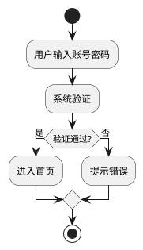
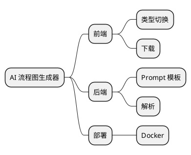
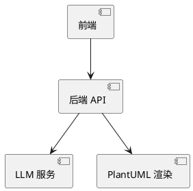

# ChartFlow - AI 图表生成器

> 用自然语言描述业务或想法，AI 在 **Excalidraw 双通道白板** 上生成并持续编辑 **流程图 / 思维导图 / 架构图**。

> ⚠️ **Status（2026-09-17）**：**S1「看得见」主干已通** —— `POST /api/chat`（SSE）→ 后端产出元素场景 IR（含坐标）→ 前端画布出图；用户已端到端实测（25 / 41 / 47 元素的复杂图均一次通过）。工程底座（M0）已闭合；执行序与阶段定义见 `workbuddyFlow/plans/masterPlan/roadmap.md`。
> 早期链路（`POST /api/generate` → PlantUML/SVG、`POST /api/download`、`static/` 旧 UI）已于 2026-09-14 **全部删除**且不会恢复（ADR-4：后端不出图）。
> 命名说明：本文件曾用名 **FlowAI**（早期链路时期），现统一为 **ChartFlow**；仓库名 `flowchart-ai` 未改。

## ✨ 特性（目标）

- 🤖 **聊天驱动出图**：用自然语言对话逐步生成、修改图表，而非一次性文本转图
- 🎨 **Excalidraw 双通道白板**：手绘画布 + AI 聊天命令改同一份图；人类拖拽与 AI 编辑互不覆盖
- 🧠 **后端持有图状态（IR）**：图的语义与坐标唯一真相源在后端 session（Redis 优先），前端只持渲染镜像
- 🔁 **全量 / 增量双协议**：S1 走全量 `result`（元素场景，含坐标）；增量 `ops` 归 S3 / v2-25
- 📖 **API 文档**：集成 springdoc-openapi，启动即获交互式 Swagger 文档
- 🐳 **容器化部署**：多阶段 Dockerfile + docker-compose
- 📐 **确定性布局**：坐标由后端布局算法算出，不交给 LLM（v2-36，S1 收尾）
- ✅ **测试覆盖**：**102** 个 JUnit 5 单元测试 + 6 个浏览器 E2E 回归 + 10 个适配层冒烟用例

## 技术栈

| 层 | 技术 |
|----|------|
| 后端 | Spring Boot 3.2 + Java 17 |
| AI | LLM（OpenAI 兼容协议；2026-09-16 实测可用型号：`mimo-v2.5` / `mimo-v2.5-pro`） |
| 图状态 | IR（语义 + 坐标），后端 session 持有（Redis 优先，内存降级） |
| 画布 | `@excalidraw/excalidraw` 0.18 双通道白板（React 18 + Vite + TS） |
| 文档 | springdoc-openapi（Swagger UI） |
| 部署 | Docker / docker-compose |

## 架构（目标）

```
用户聊天消息 {message, ctx}
   ↓  POST /api/chat（SSE 流式）
controller  ── 参数校验
   ↓
agent       ── 从 session 取当前 model（IR）；组装 prompt + 模型 + 意图
   ↓          LLM 推理（复杂任务走 ReAct + Diagram Tools 自研 MCP 改后端 model）
graph       ── 校验（field/reason/hint），不通过带 issues 再调（≤3 轮）
   ↓          落库 session
graph       ── bind（箭头吸附）→ dedup（去重）→ 校验（field/reason/hint）→ 布局（v2-36）
   ↓          不通过带 issues 再调（≤3 轮；校验 0 issue 立即下发）
前端        ── 收到 result（全量元素场景）→ convert 适配 → updateScene 重绘（用户手绘保留）
人类拖拽    ── onChange（防抖）→ 画布现状同步 PUT /api/model/canvas（与 AI 改图汇到同一份 model）
```

`LlmProvider` 是统一接口，`OpenAiCompatibleProvider` 是其实现（带 usage 日志）。
后续可在此基础上叠加：固定规则路由、限流、Token 预算、Fallback、重试、成本审计（装饰器模式）。
graph / agent / tools / session / rag / infra 等包的边界与成熟度见 `workbuddyFlow/docs/architecture.md` 2.4 包表。

## 项目结构（目标）

```
src/main/java/io/github/nihaoljx/flowchart/
├── controller/    REST + SSE 接口层（/api/chat 等，只做参数校验与编排）
├── service/       生成编排：Prompt 组装 → LLM 调用 → 解析 → 校验 → 修正循环
├── llm/           LLM 接入层：Provider 抽象、Gateway 网关、路由降级
├── graph/         图处理：SceneBinder（吸附）、SceneDeduper（去重）、GraphValidator（校验）、
│                  SceneDrift（编辑模式几何保真）、SceneLayout（布局，v2-36）
├── rag/           检索增强（阶段 2 建）
├── tools/         工具注册与执行（阶段 3 建）
├── agent/         Agent 规划与执行：真 ReAct 循环（阶段 4 建）
├── session/       会话与记忆：Store 抽象 + 内存实现（Redis 归 S5）
└── infra/         可观测：调用链 Trace、指标、审计日志（S6 建）
frontend/          Excalidraw 双通道白板（React 18 + Vite + TS；S1 已交付只读渲染 + 回写通道）
```

> 注：早期 `/api/generate`（SVG/PlantUML）链路连同 `DiagramService`、`plantuml` 依赖、`static/` 旧 UI 于 2026-09-14 一并删除；`/api/chat`（SSE）与 `/api/model/canvas` 已由 M1 / S1 补入。早期结构见 git tag `archive/v0.3-full-tasks`。

## 快速开始

### 1. 配置 LLM

密钥与端点写在 **`src/main/resources/application.yml`**（含明文 key；`.gitignore` 已忽略、永不入库）：

```yaml
llm:/n  base-url: https://api.xiaomimimo.com/v1/chat/completions   # 完整端点，代码不加后缀
  api-key: sk-你的真实key
  model: mimo-v2.5-pro
```

> 端点口诀：Key 以 `sk-` 开头走支付即付端点、以 `tp-` 开头走 Token Plan 端点；型号别猜 —— 用 `GET {base}/v1/models` 取账号实际可用清单。
> ⚠️ `llm.base-url` / `api-key` / `model` 三项**没有默认值**，缺任一项启动即报 `Error starting ApplicationContext`。

### 2. 启动

**方式 A（开发）**：IDEA 直接运行 `FlowchartApplication`。

**方式 B（命令行）**：`mvn spring-boot:run`（或 `mvn package -DskipTests` 后 `java -jar target/*.jar`）。

> 本机 Git Bash 里 `mvn` 会因 MSYS 路径转换被禁而失败，可用 `java -cp ... plexus-classworlds ... Launcher` 直启，完整命令见 `workbuddyFlow/docs/architecture.md` 第七节。

### 3. 启动前端

```bash
cd frontend && npm install && npm run dev     # http://localhost:5173（已代理 /api → :8080）
```

打开 5173 → 三栏界面（左导航 | 中画布 | 右聊天）→ 右侧输入"画一个登录流程图"。
后端接口文档：**http://localhost:8080/swagger-ui.html**。

## API 接口

启动后访问 **http://localhost:8080/swagger-ui.html** 查看交互式文档并可在线调试。

| 方法 | 路径 | 说明 |
|------|------|------|
| GET | `/api/health` | 健康检查（容器探活） |
| POST | `/api/chat` | 聊天出图 / 改图：SSE 流式返回 `thinking` / `validation` / `result` / `error` |
| PUT | `/api/model/canvas` | 画布现状同步：`positions` / `removedIds` / `userElements` / `unboundArrows` |

> 早期端点 `POST /api/generate`（文字 → SVG + PlantUML）与 `POST /api/download` 已于 2026-09-14 清算删除，
> 且不会恢复：目标架构下后端不渲染图片（见 `workbuddyFlow/docs/architecture.md` ADR-4）。

**`/api/chat` 请求体**：

```json
{ "sessionId": "xxx", "message": "加一个审核节点，连到支付之后" }
```

**响应**：SSE 事件流，末段为 `result` —— **全量**元素场景 JSON（含坐标）。事件类型：

| 事件 | 含义 |
|---|---|
| `thinking` | 第 N 轮生成中 |
| `validation` | 校验中 / 校验失败（含 issue 数） |
| `result` | 终态：全量元素场景（前端整体替换镜像） |
| `error` | 终态：失败原因（超时 / 校验 3 轮不过 / LLM 异常） |

> 会话语义：`sessionId` 对应的会话里已有模型 ⇒ 按"改这张图"处理（当前场景进 prompt，并校验"不许把用户的图换成新图 / 不许整体重排坐标"）；无模型 ⇒ 新建。

## 图表示例

（以下 PlantUML 代码块是**早期链路的历史示例**，用来说明当时的能力；后端已不再渲染 PlantUML/SVG。
目标阶段改为在 Excalidraw 白板上交互生成。）

### 流程图（flowchart）

输入：`用户输入账号密码→系统验证→进入首页`



### 思维导图（mindmap）

输入：`AI 流程图生成器的核心模块`



### 架构图（architecture）

输入：`前端调用后端，后端调 LLM 和 PlantUML`



## Docker 部署

适用于「部署到服务器 / 云」场景，本机开发不需要 Docker。

```cmd
docker compose up --build -d
docker compose logs -f
docker compose down
```

API Key 通过环境变量传入（docker-compose 已配置读取宿主机 `LLM_API_KEY`）。
如需本地 `.env`，在项目根目录创建并写入 `LLM_API_KEY=sk-xxx`（已被 `.gitignore` 忽略）。

## 测试

```bash
mvn test                                                                   # 后端单测（102 个，约 30 秒）
cd frontend && npx tsc -b && npx eslint . --ext ts,tsx && npx vite build    # 前端三绿
node frontend/tools/scene-smoke.mjs                                        # IR → 画布适配层冒烟（10 用例）
bash .playwright/run-e2e.sh                                                # 浏览器 E2E 回归（6 个，需 5173 dev server）
```

均为纯逻辑测试（E2E 除外），不依赖 Spring 容器与网络：

| 测试类 | 数量 | 覆盖 |
|---|---|---|
| `GraphValidatorTest` | 16 | 字段级校验：必填 / 类型 / 枚举 / 引用完整性 / label / points |
| `SceneDriftTest` | 14 | 编辑模式几何保真：整图重排要报，整体平移与定向修改不报 |
| `SceneBinderTest` | 10 | 两点箭头吸附升级为绑定式 |
| `SceneDeduperTest` | 9 | 与用户手绘重复的线、LLM 自画的重复线去重 |
| `GenerationServiceTest` | 16 | 生成→校验→修正循环、通过即发、编辑语境、几何保真接线 |
| `PromptServiceTest` | 9 | 契约内嵌 prompt、编辑模式、禁用 freedraw |
| `InMemorySessionStoreTest` | 11 | 会话模型 / 坐标回写 / 删除 / 手绘旁路 / 解绑 |
| `OpenAiCompatibleProviderTest` | 10 | LLM HTTP：请求拼装、响应解析、错误码、超时 |
| `DiagramControllerTest` | 7 | `/api/health` + `/api/chat` + `PUT /api/model/canvas` 契约 + 旧端点下线防回归 |

提交前跑完整门禁（与云端 CI 同一套三步）：`workbuddyFlow\run-verify.ps1`。

## 常见问题

**Q：启动报 `Error starting ApplicationContext` / 找不到 `${llm.base-url}`？**
A：`src/main/resources/application.yml` 缺字段，或没被重新拷贝到 `target/classes`（构建产物会滞后）。补齐后跑一次 `mvn clean test` 或重新构建。

**Q：LLM 报 400 而不是 401？**
A：400 = Key 有效但型号 / 参数不对；401 才是鉴权失败。用 `GET {base-url}/v1/models` 核对型号。

**Q：画布空白，但聊天说"已生成 N 个元素"？**
A：这类问题历史上有四个已修的真因：`frame` 缺 `children`、`text` 缺 `text`、绑定式箭头缺 `x/y`（→ `getCommonBounds` NaN）、`freedraw` 取景边界不可算。适配层的降级策略与冒烟用例见 `frontend/src/lib/sceneAdapter.ts`、`frontend/tools/scene-smoke.mjs`。

**Q：`mvn` 在 Git Bash 里报 ClassNotFoundException？**
A：MSYS 路径转换被禁（仅 Agent 沙箱终端进程受影响），见 `workbuddyFlow/docs/architecture.md` 第七节。

**Q：Swagger 页面打不开 / `import io.swagger` 报红？**
A：确认 `springdoc-openapi-starter-webmvc-ui` 写在 `<dependencies>` 而非 `<dependencyManagement>`。改完在 IDEA 点 **Reload All Maven Projects**。

**Q：本项目用 springfox 还是 springdoc？**
A：用 **springdoc-openapi**。Spring Boot 3 升级到 Jakarta 命名空间，老的 springfox 不兼容会启动失败。

## 路线图

执行序 **S0~S6**（`M0~M7` 是模块身份、`S` 是时间，两套编号并存）：

- **S0 底座** ✅ → **S1 看得见**（M1 + M6a；主干已通，余 v2-36 布局与收尾）→ **S2 更准**（M2 RAG）→ **S3 能改**（M3 + M6b① Diagram Tools 与增量 `ops`）→ **S4 会规划**（M4 + M6b② ReAct 过程可视化）→ **S5 不丢**（M5 Redis 持久化）→ **S6 可追踪**（M7 Trace / 指标 / 审计）
- 详细任务见 `workbuddyFlow/plans/masterPlan/`；约束与架构见 `workbuddyFlow/docs/`；知识树入口是 `workbuddyFlow/AGENTS.md`。
