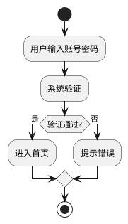
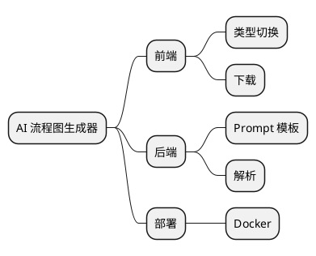
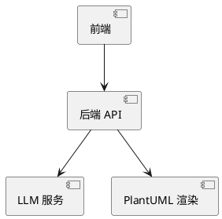

# FlowAI - AI 流程图生成器

用自然语言描述业务或想法，AI 自动生成 **流程图 / 思维导图 / 架构图**，并渲染为 SVG / PNG 直接下载。

> 教学型项目：从零搭建一个「文字 → LLM → 图表」的 Spring Boot 应用，覆盖 Prompt 工程、LLM 网关抽象、多图表解析、单元测试、容器化与 API 文档。

## ✨ 特性

- 🤖 **AI 驱动**：基于 LLM（OpenAI 兼容协议，默认接入 Moonshot/Kimi），文字一键成图
- 📊 **三种图表**：流程图（flowchart）、思维导图（mindmap）、架构图（architecture），前端一键切换
- 🖼️ **多格式导出**：SVG 矢量 / PNG 位图，浏览器直接下载
- 📖 **API 文档**：集成 springdoc-openapi，启动即获交互式 Swagger 文档
- 🐳 **容器化部署**：多阶段 Dockerfile + docker-compose，一行命令上云
- ✅ **测试覆盖**：23 个 JUnit 5 单元测试，覆盖解析 / 构建 / 模板核心逻辑

## 技术栈

| 层 | 技术 |
|----|------|
| 后端 | Spring Boot 3.2 + Java 17 |
| AI | LLM（OpenAI 兼容协议，默认 Moonshot/Kimi `kimi-k2.7-code-highspeed`） |
| 渲染 | PlantUML → SVG / PNG |
| 前端 | 原生 HTML / CSS / JS（零框架） |
| 文档 | springdoc-openapi（Swagger UI） |
| 部署 | Docker / docker-compose |

## 架构

```
用户输入文字
   ↓
PromptService  ── 按 type 选择模板，拼出结构化 Prompt
   ↓
LlmProvider    ── 调 LLM（OpenAI 兼容端点），返回文本
   ↓
ParserService  ── 解析 JSON 为 FlowchartData / MindmapData
   ↓
DiagramService ── JSON → PlantUML 源码 → 渲染 SVG / PNG
   ↓
前端展示 + 下载
```

`LlmProvider` 是统一接口，`OpenAiCompatibleProvider` 是其实现（带 usage 日志）。
后续可在此基础上叠加：固定规则路由、限流、Token 预算、Fallback、重试、成本审计（装饰器模式）。

## 项目结构

```
src/main/java/io/github/nihaoljx/flowchart/
├── FlowchartApplication.java        # 启动入口
├── client/
│   ├── LlmProvider.java             # LLM 接口（统一抽象）
│   └── OpenAiCompatibleProvider.java# OpenAI 兼容实现（含 usage 日志）
├── controller/
│   └── DiagramController.java       # REST 接口（/api/generate 等）
├── model/
│   ├── FlowchartData.java           # 流程图数据模型（节点+边）
│   ├── MindmapData.java             # 思维导图数据模型（递归树）
│   ├── Result.java                  # 统一响应格式
│   ├── GenerateRequest.java         # 生成请求 DTO（record）
│   └── DownloadRequest.java         # 下载请求 DTO（record）
├── service/
│   ├── PromptService.java           # Prompt 模板（多类型缓存）
│   ├── ParserService.java           # JSON 解析 + 校验
│   └── DiagramService.java          # PlantUML 转换 + SVG/PNG 渲染
└── config/
    └── OpenApiConfig.java           # Swagger 文档元信息

src/main/resources/
├── application.yml                  # 配置（API Key 走环境变量）
├── static/index.html, app.js       # 前端页面
└── prompts/                        # 各图表类型的 Prompt 模板
```

## 快速开始

### 1. 配置 API Key（用环境变量，不要写进代码）

```powershell
# 永久写入系统环境变量（需重开终端生效）
setx LLM_API_KEY sk-你的真实key

# 验证
echo $env:LLM_API_KEY
```

> ⚠️ 切勿把真实 Key 硬编码进 `application.yml`，也不要提交 `.env` 文件（已在 `.gitignore` 忽略）。

### 2. 启动

**方式 A（开发）**：IDEA 直接运行 `FlowchartApplication`。

**方式 B（命令行）**：

```cmd
mvn package -DskipTests
java -jar target/flowchart-0.0.1-SNAPSHOT.jar
```

### 3. 打开

浏览器访问 **http://localhost:8080**

## API 接口

启动后访问 **http://localhost:8080/swagger-ui.html** 查看交互式文档并可在线调试。

| 方法 | 路径 | 说明 |
|------|------|------|
| GET  | `/api/health` | 健康检查（容器探活） |
| POST | `/api/generate` | 生成图表（文字 → SVG + PlantUML） |
| POST | `/api/download` | 下载图表（PlantUML → SVG/PNG 文件） |

**`/api/generate` 请求体**：

```json
{
  "text": "用户输入账号密码→系统验证→进入首页",
  "type": "flowchart",
  "format": "svg"
}
```

- `type`：`flowchart` / `mindmap` / `architecture`
- `format`：`svg` / `png`

**响应**（节选）：

```json
{
  "code": 0,
  "data": {
    "svg": "<svg ...>",
    "plantUml": "@startuml\n...",
    "type": "flowchart"
  }
}
```

## 图表示例

### 流程图（flowchart）

输入：`用户输入账号密码→系统验证→进入首页`



### 思维导图（mindmap）

输入：`AI 流程图生成器的核心模块`



### 架构图（architecture）

输入：`前端调用后端，后端调 LLM 和 PlantUML`



## Docker 部署

适用于「部署到服务器 / 云」场景，本机开发不需要 Docker。

```cmd
# 构建并启动
docker compose up --build -d

# 查看日志
docker compose logs -f

# 停止
docker compose down
```

API Key 通过环境变量传入（docker-compose 已配置读取宿主机 `LLM_API_KEY`）。
如需本地 `.env`，在项目根目录创建并写入 `LLM_API_KEY=sk-xxx`（已被 `.gitignore` 忽略）。

## 测试

```cmd
mvn test
```

覆盖 `DiagramService`（7）、`ParserService`（11）、`PromptService`（5）共 23 个单元测试，均为纯逻辑测试，不依赖 Spring / 网络。

## 常见问题

**Q：启动后提示「服务未配置：请联系管理员设置 LLM_API_KEY」？**
A：环境变量没传进运行进程。用 IDEA 启动时，需在 Run Configuration 的 Environment variables 里加 `LLM_API_KEY=...`，或彻底重启 IDEA 让其继承新系统变量。

**Q：Swagger 页面打不开 / `import io.swagger` 报红？**
A：确认 `springdoc-openapi-starter-webmvc-ui` 写在 `<dependencies>` 而非 `<dependencyManagement>`（后者只管版本、不引入 jar）。改完在 IDEA 点 **Reload All Maven Projects**。

**Q：本项目用 springfox 还是 springdoc？**
A：用 **springdoc-openapi**。Spring Boot 3 升级到 Jakarta 命名空间，老的 springfox 不兼容会启动失败。

## 路线图 / 学习延伸

- LLM Gateway 六层：固定路由 / 限流 / Token 预算 / Fallback / 重试 / 成本审计
- 接 RAG：让 AI 基于私有知识库生成图表
- 接 Agent：多步推理自动产出复杂架构
