# Mermaid 流程图语法速查表（RAG 知识库版）

> 本文档按知识点切分，每个代码块独立成 chunk，便于向量化检索。
> 标签体系：#mermaid #flowchart #syntax #符号 #布局 #样式

---

## Chunk 1: 流程图基础声明与方向

**标签**: `#mermaid` `#flowchart` `#基础声明` `#方向`

Mermaid 流程图使用 `flowchart` 关键字声明，后跟方向标识符：

| 方向标识符 | 含义 |
|-----------|------|
| `TB` / `TD` | 从上到下 (Top-Bottom / Top-Down) |
| `BT` | 从下到上 (Bottom-Top) |
| `LR` | 从左到右 (Left-Right) |
| `RL` | 从右到左 (Right-Left) |

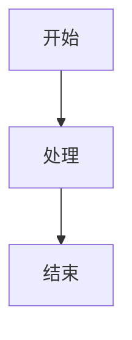

**规则要点**：
- 方向必须在首行声明后紧跟
- 一个 flowchart 只能有一个主方向
- 子图 (subgraph) 可以独立声明方向

---

## Chunk 2: 节点形状与符号规范

**标签**: `#mermaid` `#flowchart` `#节点` `#符号` `#形状`

Mermaid 支持多种节点形状，对应不同语义：

| 语法 | 形状 | 语义 | 示例 |
|------|------|------|------|
| `id[文本]` | 矩形 | 普通处理步骤 | `A[用户登录]` |
| `id(文本)` | 圆角矩形 | 开始/结束 | `B(开始)` |
| `id((文本))` | 圆形 | 连接点/汇合点 | `C((汇合))` |
| `id>文本]` | 旗帜形 | 输出/显示 | `D>显示结果]` |
| `id{文本}` | 菱形 | 判断/决策 | `E{是否登录?}` |
| `id[/文本/]` | 平行四边形(左斜) | 输入/输出 | `F[/输入用户名/]` |
| `id[\文本\]` | 平行四边形(右斜) | 输入/输出 | `G[\输出数据\]` |
| `id[(文本)]` | 圆柱形 | 数据库/存储 | `H[(用户数据库)]` |
| `id((文本))` | 双圆 | 子流程开始/结束 | `I((子流程))` |
| `id>文本]` | 不对称矩形 | 延迟/等待 | `J>等待响应]` |
| `id{{文本}}` | 六边形 | 准备/预处理 | `K{{预处理}}` |

**重要规则**：
- 节点 ID 必须唯一，通常使用简短字母或驼峰命名
- 节点文本支持中文，但 ID 建议用英文或拼音
- 文本中如需使用特殊字符，需用引号包裹：`A["包含[括号]的文本"]`

---

## Chunk 3: 连线类型与流向控制

**标签**: `#mermaid` `#flowchart` `#连线` `#箭头` `#流向`

### 3.1 基础连线

| 语法 | 含义 | 示例 |
|------|------|------|
| `-->` | 带箭头实线 | `A --> B` |
| `---` | 无箭头实线 | `A --- B` |
| `-->text-->` | 带标签的箭头 | `A -- 是 --> B` |
| `-.->` | 虚线箭头 | `A -.-> B` |
| `==>` | 粗线箭头 | `A ==> B` |
| `--x` | 带叉箭头（终止） | `A --x B` |
| `--o` | 带圆箭头（连接） | `A --o B` |

### 3.2 多分支连线

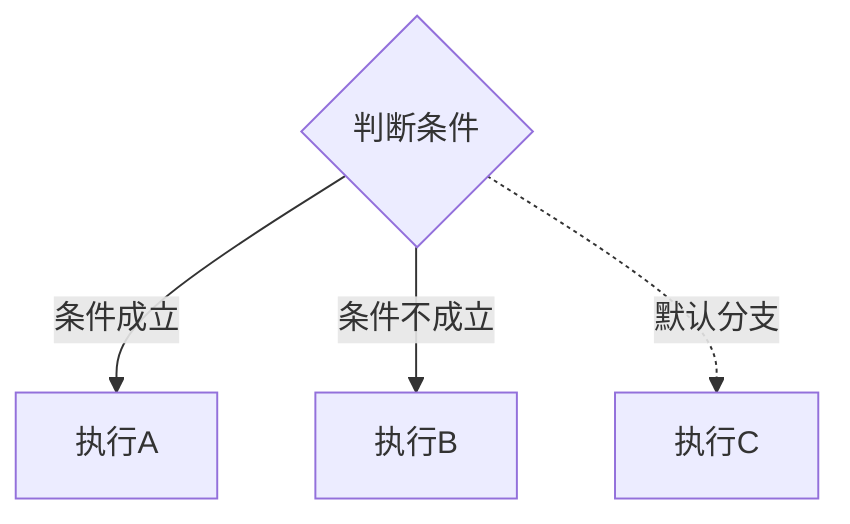

### 3.3 连线样式自定义

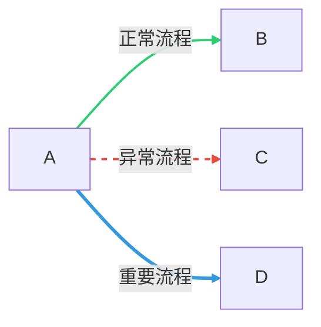

**规则要点**：
- 连线标签用 `-- 标签 -->` 或 `|-- 标签 -->|` 语法
- 标签支持中文
- `linkStyle` 按连线定义顺序从 0 开始编号

---

## Chunk 4: 子图（Subgraph）

**标签**: `#mermaid` `#flowchart` `#子图` `#分组` `#模块化`

子图用于将相关节点分组，提高可读性：

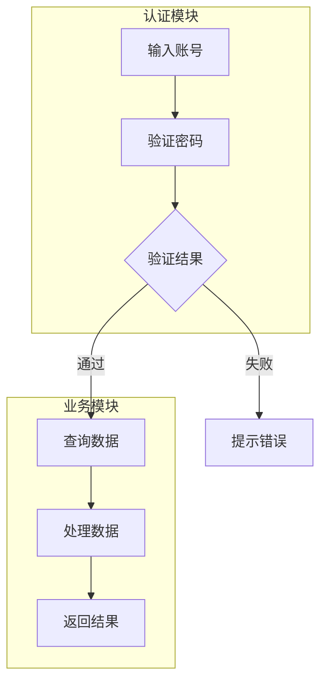

### 子图方向控制

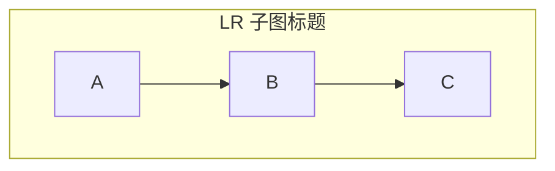

**规则要点**：
- 子图可以声明独立方向
- 子图之间可以连线
- 子图支持嵌套（但不建议超过 2 层）
- 子图标题支持中文

---

## Chunk 5: 样式与类（ClassDef）

**标签**: `#mermaid` `#flowchart` `#样式` `#CSS` `#颜色` `#类定义`

### 5.1 类定义语法

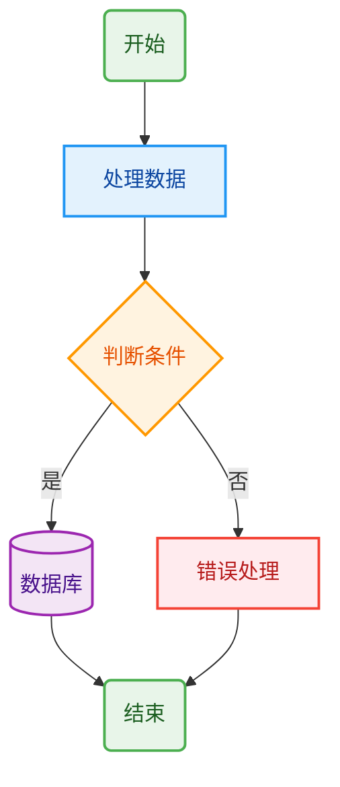

### 5.2 支持的样式属性

| 属性 | 说明 | 示例值 |
|------|------|--------|
| `fill` | 填充色 | `#e3f2fd`, `rgb(227,242,253)` |
| `stroke` | 边框色 | `#2196f3` |
| `stroke-width` | 边框宽度 | `2px`, `3px` |
| `stroke-dasharray` | 虚线样式 | `5 5` |
| `color` | 文字颜色 | `#0d47a1` |
| `font-size` | 字体大小 | `14px` |
| `font-family` | 字体 | `Arial, sans-serif` |

### 5.3 常用配色方案

**科技蓝方案**：
```
classDef default fill:#f8fafc,stroke:#3b82f6,stroke-width:2px
classDef primary fill:#dbeafe,stroke:#2563eb,stroke-width:2px
classDef success fill:#dcfce7,stroke:#16a34a,stroke-width:2px
classDef warning fill:#fef3c7,stroke:#d97706,stroke-width:2px
classDef danger fill:#fee2e2,stroke:#dc2626,stroke-width:2px
```

**专业灰方案**：
```
classDef default fill:#fafafa,stroke:#737373,stroke-width:1px
classDef process fill:#e5e5e5,stroke:#404040,stroke-width:2px
classDef decision fill:#fef9c3,stroke:#a16207,stroke-width:2px
classDef terminal fill:#dcfce7,stroke:#15803d,stroke-width:2px
```

---

## Chunk 6: 注释与元数据

**标签**: `#mermaid` `#flowchart` `#注释` `#元数据`


**注释规则**：
- 使用 `%%` 开头
- 注释内容不会出现在渲染图中
- 可用于记录版本、作者、修改日期等元数据

---

## Chunk 7: 高级特性

**标签**: `#mermaid` `#flowchart` `#高级特性` `#点击事件` `#回调`

### 7.1 点击事件

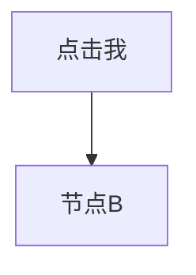

### 7.2 多节点同时定义样式

```mermaid
flowchart TD
    classDef important fill:#ffebee,stroke:#f44336,stroke-width:3px
    class A,B,C important
```

### 7.3 节点文本换行

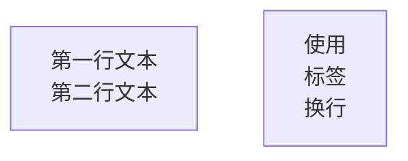

---

## Chunk 8: 常见错误与修正

**标签**: `#mermaid` `#flowchart` `#错误` `#排错` `#常见问题`

| 错误现象 | 原因 | 修正方法 |
|---------|------|---------|
| 节点不显示 | ID 包含非法字符 | 使用字母数字下划线，或加引号 |
| 连线断裂 | 节点 ID 拼写错误 | 检查 ID 一致性 |
| 样式不生效 | classDef 定义在节点之后 | classDef 必须在节点之前定义 |
| 中文乱码 | 编码问题 | 确保文件为 UTF-8 编码 |
| 子图连线异常 | 子图方向与主图冲突 | 显式声明子图方向 |
| 标签显示不全 | 标签语法错误 | 使用 `-- 标签 -->` 格式 |
| 渲染失败 | 语法错误 | 检查括号是否成对、引号是否闭合 |

---

## Chunk 9: Mermaid 其他图表类型速览

**标签**: `#mermaid` `#图表类型` `#时序图` `#类图` `#状态图`

### 9.1 时序图 (Sequence Diagram)

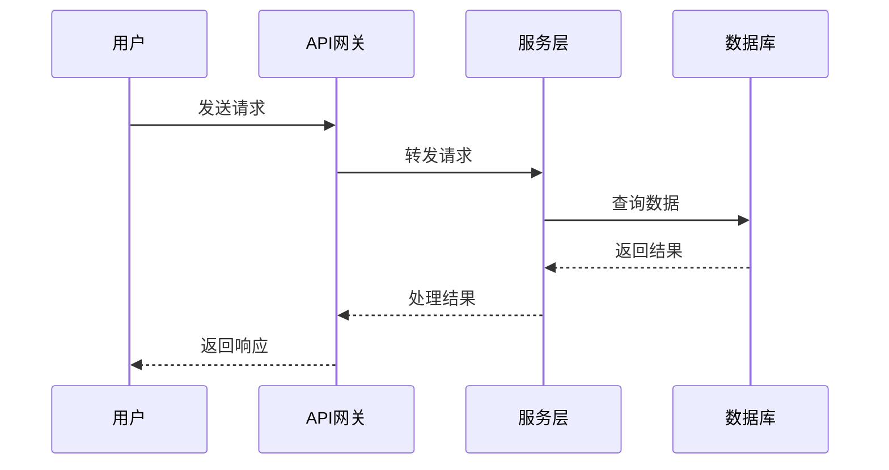

### 9.2 类图 (Class Diagram)

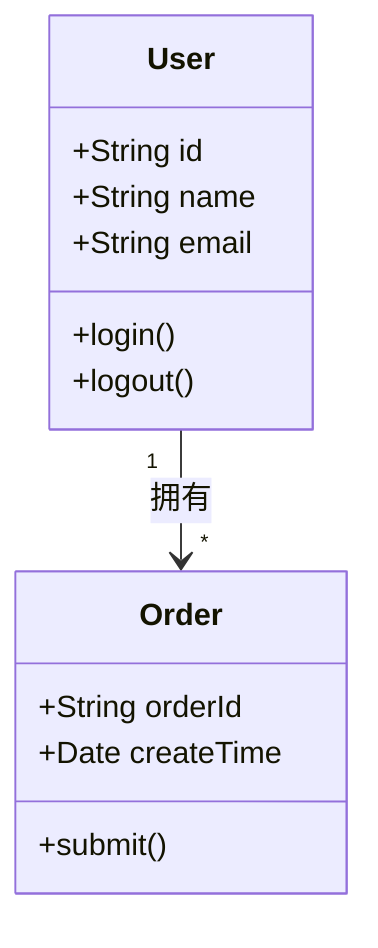

### 9.3 状态图 (State Diagram)

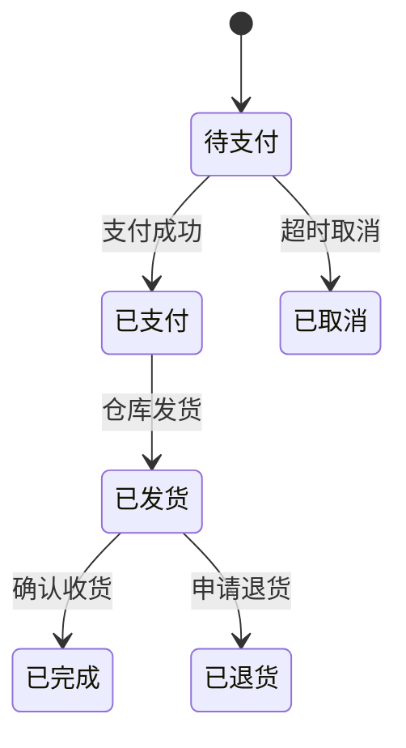

### 9.4 甘特图 (Gantt)

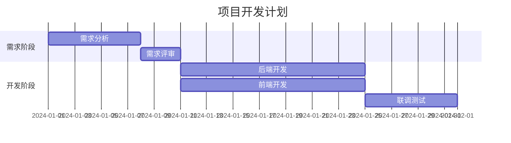

---

## Chunk 10: 完整复杂示例

**标签**: `#mermaid` `#flowchart` `#完整示例` `#电商` `#订单流程`

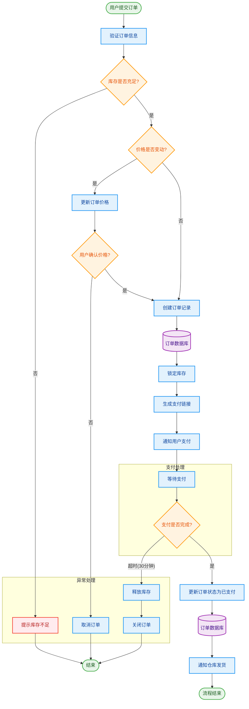
